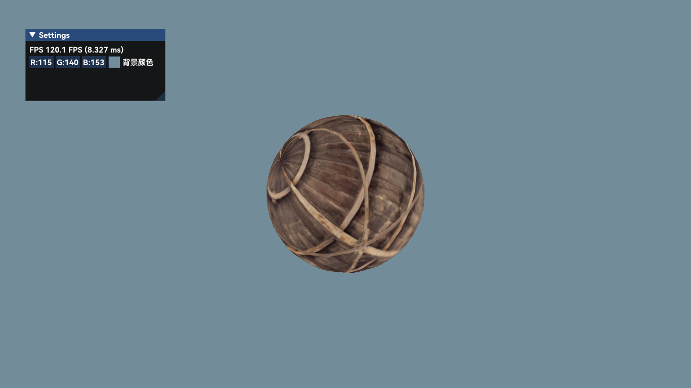
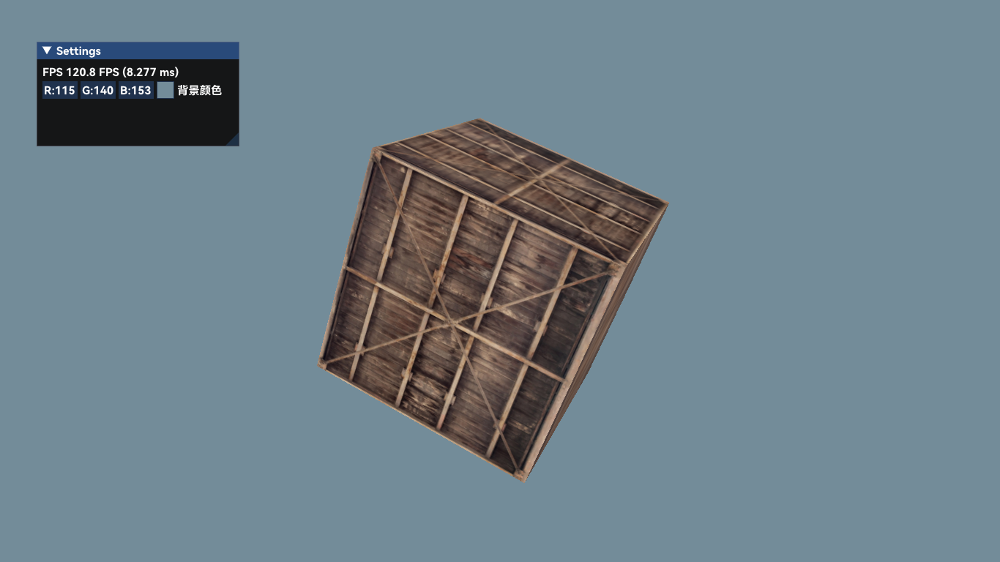

### 说明

这是一个 OpenGL 的学习项目。

### 

### 参考

https://learnopengl.com/

OpenGL Template for INM376 / IN3005 - City University London 

### 功能

+ [x] 纹理

### Gallery

        
     
    

        带纹理的球
    
 

        
     
    

        带纹理的立方体
    
 

